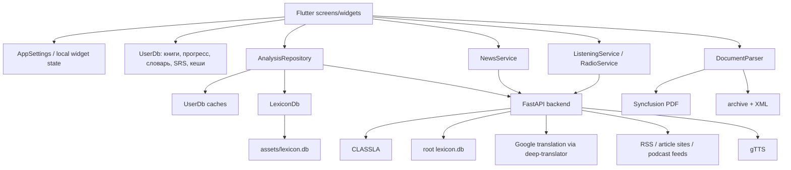

# Citavuk: подробный технический путеводитель для AI-агента

> Актуальность документа: 24 июля 2026 года.  
> Репозиторий: `C:\citavuk`.  
> Основное приложение: `C:\citavuk\frontend`.  
> Бэкенд: `C:\citavuk\backend`.

Этот документ предназначен для AI-агента или разработчика, который впервые
открывает проект Citavuk и должен безопасно продолжить разработку. Здесь
описаны не только файлы, но и реальные потоки данных, платформенные различия,
неочевидные ограничения и обязательные проверки.

Документ описывает текущее состояние исходников. Если комментарий в коде,
старый `README.md` и этот файл расходятся, источники истины следует проверять в
таком порядке:

1. Исполняемый код и конфигурация сборки.
2. `AGENTS.md` с локальными правилами работы.
3. Этот документ.
4. Корневой `README.md` и `frontend/README.md`.

## 1. Что такое Citavuk

Citavuk, или «Читавук», — приложение для русскоязычных пользователей, изучающих
сербский язык через чтение и аудирование.

Название объединяет русское «читать» и сербское `vuk` — «волк». Основной
маскот — волк Читавук. В разделе аудирования используется второй маскот:
черногорский орёл Слухао.

Основной пользовательский сценарий:

1. Пользователь импортирует PDF или DOCX либо открывает встроенную книгу.
2. Приложение извлекает текст и делит его на абзацы.
3. Пользователь читает текст постранично.
4. Нажатие на слово открывает перевод, лемму, часть речи, признаки формы и
   грамматическое объяснение.
5. Долгое нажатие с протягиванием на мобильном или drag мышью на desktop/web
   выделяет фразу.
6. Слово можно сохранить в словарь книги.
7. Сохранённые слова становятся карточками интервального повторения.
8. Отдельные разделы дают грамматические темы, новости на сербском и
   аудирование с подсвечиваемой транскрипцией.

Приложение задумано как offline-first, но фактически уровень автономности
различается по платформам:

- Android/Windows/macOS/Linux имеют встроенный морфологический лексикон.
- Web хранит пользовательские данные локально, но встроенный морфологический
  `lexicon.db` сейчас не открывает. Для качественного разбора web зависит от
  бэкенда.
- Перевод новых слов и контекстный перевод требуют сети. Уже полученные
  переводы и полные разборы кешируются.

## 2. Технологический стек

### 2.1 Клиент

- Flutter 3.44.x.
- Dart 3, диапазон SDK: `>=3.0.0 <4.0.0`.
- Material 3.
- `provider` для глобальных пользовательских настроек.
- `sqflite` для Android/iOS.
- `sqflite_common_ffi` для Windows/Linux/macOS.
- `sqflite_common_ffi_web` + `sqlite3.wasm` + IndexedDB для web.
- `syncfusion_flutter_pdf` для извлечения текста из PDF.
- `archive` + `xml` для DOCX.
- `audioplayers` для радио, подкастов и TTS.
- `file_picker` для импорта документов и Markdown-карточек.
- `shared_preferences` для настроек интерфейса.
- `http` для бэкенда и переводчиков.
- `url_launcher` для внешних ссылок.

Пакет приложения пока называется `srbski_read`, хотя пользовательский бренд,
имя Windows-exe, Android label и web title уже изменены на Citavuk.

### 2.2 Сервер

- Python 3.10.
- FastAPI + Uvicorn.
- CLASSLA для сербской токенизации, лемматизации и POS/feature-разбора.
- SQLite-лексикон как серверный fallback.
- `deep-translator`, но фактически используется `GoogleTranslator`.
- `feedparser` для RSS.
- `trafilatura` для извлечения текста новостей.
- `gTTS` для озвучивания сербских предложений.

Продакшен-бэкенд по умолчанию:

```text
https://ivanessalingren-citavukspace.hf.space
```

Он размещается как Docker Space на Hugging Face.

## 3. Карта репозитория

```text
C:\citavuk
├── AGENTS.md                    # обязательные локальные правила для агентов
├── PROJECT_AGENT_GUIDE.md       # этот подробный путеводитель
├── README.md                    # обзор проекта, местами менее актуальный
├── Dockerfile                   # образ бэкенда для Hugging Face Spaces
├── backend/
│   ├── main.py                  # FastAPI, NLP, новости, перевод, аудио
│   ├── requirements.txt
│   └── audio_lessons.json       # вручную курируемые аудиоуроки
├── frontend/
│   ├── lib/
│   │   ├── main.dart
│   │   ├── models/
│   │   ├── screens/
│   │   ├── services/
│   │   ├── state/
│   │   ├── theme/
│   │   ├── utils/
│   │   └── widgets/
│   ├── assets/
│   │   ├── lexicon.db
│   │   ├── fonts/
│   │   ├── imgs/
│   │   ├── library/
│   │   ├── test_story.docx
│   │   └── test_story.pdf
│   ├── android/
│   ├── ios/
│   ├── web/
│   ├── windows/
│   ├── linux/
│   ├── macos/
│   ├── pubspec.yaml
│   └── test/
├── data/ud/                     # UD_Serbian-SET в формате CoNLL-U
├── build_lexicon.py             # сборка компактного лексикона
├── download_srlex.py            # эксперимент с большим SrLex
├── database_generator.py        # исторический генератор
├── lexicon.db                   # серверная копия словаря
└── .github/workflows/
    └── build-apk.yml
```

Не редактировать вручную без специальной причины:

- `frontend/*/flutter/generated_*`;
- `frontend/.dart_tool/`;
- `frontend/build/`;
- сгенерированные launcher icons, если источником должен оставаться
  `assets/imgs/citavuk_icon.png`;
- бинарные SQLite-файлы через текстовые инструменты.

## 4. Архитектура верхнего уровня



Архитектурные границы:

- Модели не должны выполнять I/O.
- Экран не должен напрямую разбирать SQLite, RSS или XML.
- Сетевой и языковой orchestration находится в `services/`.
- Отображение грамматики не должно само угадывать формы: оно получает данные от
  `GrammarEngine`.
- Платформенный I/O изолируется условными импортами.

## 5. Запуск приложения

### 5.1 Окружение Windows

Основной Flutter SDK:

```text
C:\flutter_windows_3.44.0-stable\flutter
```

Если `flutter` отсутствует в `PATH`, использовать:

```powershell
C:\flutter_windows_3.44.0-stable\flutter\bin\flutter.bat
C:\flutter_windows_3.44.0-stable\flutter\bin\dart.bat
```

Запуск:

```powershell
cd C:\citavuk\frontend
C:\flutter_windows_3.44.0-stable\flutter\bin\flutter.bat pub get
C:\flutter_windows_3.44.0-stable\flutter\bin\flutter.bat run -d windows
```

Web:

```powershell
cd C:\citavuk\frontend
C:\flutter_windows_3.44.0-stable\flutter\bin\flutter.bat run -d chrome
```

После изменения пакетов обязательно:

```powershell
flutter clean
flutter pub get
```

Это особенно важно на Windows: старый `package_config` и CMake cache уже
вызывали ложные ошибки отсутствующих пакетов и старого target name.

### 5.2 Запуск бэкенда

```powershell
cd C:\citavuk
python -m pip install -r backend\requirements.txt
cd backend
python main.py
```

Локальный `python main.py` слушает `0.0.0.0:8000`. Docker запускает Uvicorn на
порту `7860`.

Первый запуск CLASSLA может быть долгим: `lifespan()` вызывает
`classla.download('sr')`, затем создаёт pipeline с процессорами
`tokenize,pos,lemma`. Если загрузка или инициализация не удалась, сервер
остаётся жив и переходит в SQLite-only режим.

Проверка:

```text
GET http://127.0.0.1:8000/health
```

Ожидаемый ответ:

```json
{"status":"ok","nlp":true}
```

`nlp: false` означает, что FastAPI работает, но CLASSLA недоступна.

## 6. Инициализация Flutter-приложения

Точка входа — `frontend/lib/main.dart`.

Последовательность:

1. `WidgetsFlutterBinding.ensureInitialized()`.
2. `initDatabaseFactory()` выбирает реализацию SQLite.
3. Создаётся и загружается `AppSettings`.
4. `AnalysisRepository.baseUrl` получает сохранённый URL бэкенда.
5. Инициализируется `NotificationService` — сейчас это no-op.
6. Запускается `ChitavukApp`.
7. `ChitavukApp` предоставляет `AppSettings` через `ChangeNotifierProvider`.
8. `MaterialApp` строится с light/dark themes и `themeMode` из настроек.
9. Стартовый экран — `DashboardScreen`.

`AppSettings` должен быть единственным источником глобальных настроек чтения,
темы, радио, напоминаний и адреса сервера.

## 7. Основные экраны

### 7.1 `main.dart`: библиотека и навигация

`DashboardScreen` отвечает за:

- список локальных книг;
- фильтрацию по папкам;
- встроенную бесплатную библиотеку;
- импорт PDF/DOCX;
- открытие книги и ленивую загрузку её текста;
- удаление, переименование и перемещение книги;
- переходы к новостям, аудированию и грамматике;
- импорт/экспорт карточек;
- экран сервера/словаря;
- about и Telegram-ссылку;
- приветственный диалог первого запуска.

Критичное правило производительности: `UserDb.getBooks()` не выбирает колонку
`content`. Полный текст загружается только в `_openBook()` через
`UserDb.getBookContent(bookId)`.

Нельзя возвращать `content` в запрос главной страницы. На web это немедленно
загружает все книги из IndexedDB в память браузера.

### 7.2 `book_reader_screen.dart`: читалка

`BookReaderScreen` получает:

```dart
bookId
title
paragraphs
initialParagraph
leadImageUrl
```

Текущая модель чтения:

- при открытии полный список абзацев выбранной книги уже находится в памяти;
- `_chunkParagraphs()` формирует логические страницы примерно по 1500 символов;
- `PageView.builder` строит виджет только для нужной страницы и соседей;
- `_pageStartPara` связывает страницу с первым абзацем;
- прогресс хранится как индекс абзаца, а не страницы;
- стрелки, клавиши Left/Right и PageUp/PageDown меняют страницу;
- на мобильном фраза выделяется долгим нажатием;
- на desktop/web фраза выделяется press-and-drag;
- drag мыши не листает страницу, чтобы не конфликтовать с выделением;
- радио доступно из AppBar;
- заглавная картинка используется для новостной статьи.

Важно: реализована ленивая отрисовка страниц, но не ленивая загрузка книги из
БД. Открытая книга целиком остаётся в `widget.paragraphs`, а ссылки на её
абзацы дополнительно распределяются по `_pages`. Если понадобится поддержка
очень больших книг без полного текста в памяти, придётся менять формат хранения:
например, вынести абзацы в таблицу `book_paragraphs(book_id, idx, text)` и
запрашивать окно страниц.

### 7.3 Разбор слова в читалке

`ReaderParagraph` токенизирует абзац и строит `TextSpan` для каждого токена.
Слова имеют recognizer, пробелы и пунктуация остаются отдельными токенами.

Нажатие:

1. Создаёт выделение токена.
2. Открывает `WordAnalysisSheet`.
3. Sheet вызывает `AnalysisRepository.analyzeToken()`.
4. Показывает контекстный и общий перевод.
5. Показывает лемму, POS, признаки и базовые формы.
6. Даёт сохранить слово в `vocabulary`.
7. Даёт открыть подробный `GrammarScreen`.

После закрытия sheet выделение очищается.

### 7.4 `vocabulary_screen.dart` и `flashcards_screen.dart`

`VocabularyScreen` показывает сохранённые слова конкретной книги и запускает
повторение.

`FlashcardsScreen`:

- запрашивает только карточки, срок которых наступил;
- показывает слово, затем ответ;
- принимает оценки «снова», «хорошо», «легко»;
- вызывает `UserDb.gradeCard()`;
- использует упрощённый SM-2.

### 7.5 Грамматика

- `GrammarScreen` показывает разбор конкретной формы и таблицы парадигм.
- `GrammarCardsScreen` показывает список тем, а не одну бесструктурную колоду.
- `GrammarTopicScreen` содержит вводное объяснение, секции правила и
  flip-карточки темы.

Текущие темы задаются непосредственно в
`GrammarEngine.grammarTopics()`. При добавлении темы данные, объяснения и
карточки следует держать вместе.

### 7.6 Новости

`NewsScreen`:

- имеет пять тем: общее, политика, культура, в тренде, наука;
- загружает карточки через `NewsService`;
- сохраняет текущий список во время тихого обновления;
- обновляется по таймеру и при возвращении приложения в foreground;
- при открытии статьи получает полный текст с сервера;
- сохраняет статью как книгу через `UserDb.upsertBook()`;
- открывает её через обычный `BookReaderScreen`;
- проксирует картинку через бэкенд для обхода CORS.

### 7.7 Аудирование

`ListeningScreen` — beta-раздел:

- загружает курируемые уроки и подкасты;
- позволяет озвучить текст уже импортированной книги;
- открывает `ListeningPlayerScreen`.

`ListeningPlayerScreen`:

- воспроизводит потоковый подкаст или последовательность TTS-фрагментов;
- поддерживает скорости, доступные в UI;
- синхронизирует текущую реплику с позицией аудио;
- подсвечивает звучащие слова;
- особо маркирует слова, сложные для восприятия на слух;
- позволяет нажать слово и сохранить его через обычный анализ.

Тайминги подкастов сейчас приблизительные: транскрипт растягивается
пропорционально длине реплик на длительность записи. Это не forced alignment и
не word-level timestamping.

### 7.8 Радио

`RadioService` — отдельная функция фоновой музыки для чтения. Не путать её с
аудированием:

- радио — непрерывный фоновый поток;
- аудирование — учебный материал с транскриптом и разбором слов.

`RadioAppBarButton` может показывать только иконку или иконку с подписью.
`RadioControlSheet` выбирает станцию, громкость и состояние playback.

## 8. Модели данных Flutter

### 8.1 `WordAnalysis`

Поля:

- `surface` — выделенная форма;
- `lemma` — начальная форма;
- `upos` — Universal POS;
- `feats` — UD features;
- `forms` — полезные базовые формы;
- `translation` — общий перевод;
- `contextualTranslation` — значение в текущем предложении;
- `isOffline` — результат был получен без полноценного online path;
- `isPhrase` — выделено несколько слов;
- `phraseInsight` — объяснение составного времени и/или энклитик.

Контекстный перевод не входит в `analysis_cache`, потому что одинаковое слово в
разных предложениях имеет разные значения.

### 8.2 Грамматические модели

- `GrammarFact` — человекочитаемый признак.
- `GrammarInfo` — POS, факты, краткое описание и объяснение.
- `ParadigmCell` — строка таблицы формы.
- `ParadigmTable` — таблица склонения/спряжения.
- `RuleCard` — карточка вопрос/ответ.
- `PhraseInsight` — разбор конструкции в выделенной фразе.
- `GrammarTopic` — полноценная тема.
- `PrepositionGovernment` — управление предлога.

`ParadigmCell.generated == true` означает приблизительную форму, построенную
правилом. UI обязан визуально отличать её и не выдавать за словарно
подтверждённую.

### 8.3 `ReaderSettings`

Содержит:

- размер, семейство, высоту строки и межбуквенный интервал;
- bionic reading;
- light/dark/system theme;
- расстояние между абзацами;
- красную строку;
- выравнивание;
- ширину колонки;
- пользовательский цвет фона.

Модель иммутабельна. Изменения выполняются через `copyWith()` и сохраняются
`AppSettings`.

### 8.4 Новости и аудио

`NewsItem` — карточка RSS.  
`NewsArticle` — заголовок, картинка, источник, дата и абзацы.

`AudioLesson` может работать в двух режимах:

- `audioUrl != null`: потоковое аудио;
- `audioUrl == null`: TTS по отдельным репликам.

`AudioCue.start/end` могут отсутствовать у TTS-реплик.

## 9. Пользовательская база данных

Файл: `frontend/lib/services/user_db.dart`.

### 9.1 Расположение

- Web: логическое имя `chitavuk_user.db`, хранение через IndexedDB.
- Native: `getApplicationDocumentsDirectory()/chitavuk_user.db`.

`openDatabase()` имеет `version: 1`, а миграции выполняются идемпотентно в
`onOpen` через `CREATE TABLE IF NOT EXISTS` и защищённые `ALTER TABLE`.

Это работает, но не является чистой версионной миграцией. Для будущих сложных
изменений лучше поднять версию и добавить `onUpgrade`.

### 9.2 Таблица `books`

```sql
id          INTEGER PRIMARY KEY AUTOINCREMENT
title       TEXT NOT NULL
filepath    TEXT NOT NULL
content     TEXT NOT NULL
last_para   INTEGER DEFAULT 0
added_at    DATETIME DEFAULT CURRENT_TIMESTAMP
folder      TEXT NOT NULL DEFAULT ''
para_count  INTEGER NOT NULL DEFAULT 0
```

`content` — JSON-массив всех абзацев.  
`last_para` — индекс первого абзаца текущей логической страницы.  
`para_count` нужен для прогресса без чтения тяжёлого `content`.

`filepath` также используется как уникальный логический ключ при
`upsertBook()`, хотя SQL-ограничения `UNIQUE` нет.

### 9.3 Таблица `vocabulary`

```sql
id           INTEGER PRIMARY KEY AUTOINCREMENT
book_id      INTEGER NOT NULL
word         TEXT NOT NULL
lemma        TEXT NOT NULL
pos          TEXT NOT NULL
translation  TEXT NOT NULL
forms        TEXT NOT NULL
added_at     DATETIME DEFAULT CURRENT_TIMESTAMP
```

`forms` хранится как JSON. Внешние ключи на уровне SQLite не объявлены;
каскадное удаление выполняет `UserDb.deleteBook()`.

### 9.4 Таблица `reviews`

```sql
vocab_id       INTEGER PRIMARY KEY
ease           REAL NOT NULL DEFAULT 2.5
interval       INTEGER NOT NULL DEFAULT 0
reps           INTEGER NOT NULL DEFAULT 0
due_at         INTEGER NOT NULL DEFAULT 0
last_reviewed  INTEGER
```

Время — milliseconds since epoch.

Алгоритм:

- `grade == 0`: сброс повторов, минус к ease, повтор через 10 минут;
- первая успешная оценка: 1 день;
- вторая: 3 дня;
- следующие: предыдущий interval × ease;
- «легко» дополнительно повышает ease и interval.

### 9.5 Кеши

`translation_cache`:

```sql
word         TEXT PRIMARY KEY
translation  TEXT NOT NULL
added_at     DATETIME DEFAULT CURRENT_TIMESTAMP
```

`analysis_cache`:

```sql
word      TEXT PRIMARY KEY
json      TEXT NOT NULL
added_at  DATETIME DEFAULT CURRENT_TIMESTAMP
```

Ключ нормализуется через `trim().toLowerCase()`. В нём пока не учитываются
язык, версия анализатора или версия лексикона. При изменении семантики разбора
может понадобиться инвалидировать кеш либо включить версию в ключ.

## 10. Встроенный лексикон

Файл клиента: `frontend/assets/lexicon.db`.  
Файл сервера: `lexicon.db`.

Основные таблицы:

```text
lexicon(form, lemma, upos, feats, msd)
dictionary(word, translation)
```

Источником морфологии служит `data/ud/*.conllu` из UD_Serbian-SET.
`build_lexicon.py` пересобирает компактную базу.

### 10.1 Native

`lexicon_fs_io.dart` копирует asset в application support directory:

```text
chitavuk_lexicon_v<version>.db
```

`LexiconDb` открывает копию read-only. При изменении содержимого ассета
обязательно поднять `_version` в `lexicon_db.dart`, иначе старые установки не
получат новую базу.

Загружаемый внешний словарь сначала пишется во временный файл, проверяется на
наличие таблицы `lexicon`, затем заменяет рабочую копию.

### 10.2 Web

`lexicon_fs_web.dart` возвращает `null`. Поэтому:

- встроенный read-only лексикон на web выключен;
- `lookupForm()` и локальные формы возвращают пустой результат;
- разбор должен прийти с бэкенда;
- сохранённые разборы остаются доступны через `analysis_cache`.

Не путать это с пользовательской БД: `UserDb` на web работает через WASM.

### 10.3 SQLite WASM

В `pubspec.yaml` версия `sqlite3` зафиксирована на `3.3.2`, а
`web/sqlite3.wasm` должен быть взят из того же релиза. Несовпадение ABI раньше
вызывало:

```text
WebAssembly.instantiate(): Import "env": module is not an object or function
```

Не обновлять `sqlite3` отдельно от `web/sqlite3.wasm`.

## 11. Извлечение PDF и DOCX

Файл: `frontend/lib/services/document_parser.dart`.

### 11.1 Native

- Вход — `Uint8List`.
- Создаётся отдельный isolate.
- Прогресс передаётся через `SendPort`.
- PDF извлекается постранично, а не одной огромной строкой.
- DOCX распаковывается как ZIP и читается `word/document.xml`.
- По завершении isolate возвращает `List<String>`.

Это предотвращает блокировку UI при больших документах.

### 11.2 Web

`dart:isolate` недоступен в dart4web, поэтому используются отдельные
асинхронные web-core функции. Они периодически уступают управление event loop,
но тяжёлая библиотечная операция всё равно может быть заметна.

DOCX должен обрабатываться полностью в Dart:

1. `ZipDecoder().decodeBytes(bytes)`.
2. Поиск `word/document.xml`.
3. Разбор XML.
4. Сбор текста из `w:p`, `w:r` и `w:t`.

При web-регрессии сначала проверить:

- `file_picker` действительно вернул `bytes`;
- код не обращается к `file.path`;
- документ не защищён и действительно является DOCX ZIP;
- XML namespace не мешает `findAllElements('w:p')`;
- исключение отображается пользователю, а не превращается в «пустой документ».

### 11.3 Нормализация текста

Очень длинные абзацы дробятся по границам предложений. Слишком агрессивное
дробление вредно для оффсетов токенов и контекстного перевода, поэтому любые
изменения нужно проверять на PDF и DOCX с сербской кириллицей и латиницей.

## 12. Определение языка

Файл: `frontend/lib/utils/language_detector.dart`.

Проверка вызывается после импорта документа, чтобы предупредить о вероятно
несербском тексте. Это эвристика, а не полноценная language identification
model.

Сербский и русский используют много общих кириллических букв. Надёжные
сербские сигналы:

- `ј`, `љ`, `њ`, `ђ`, `ћ`, `џ`;
- сербские латинские диакритики;
- частотные сербские служебные слова.

Нельзя считать любой кириллический текст сербским. При изменении детектора
обязательны тесты минимум на:

- сербскую латиницу;
- сербскую кириллицу;
- русский текст;
- короткие заголовки;
- смешанный текст.

Предупреждение не должно запрещать импорт: короткие фрагменты неизбежно
неоднозначны.

## 13. Токенизация и выбор фраз

`SerbianTokenizer` создаёт токены с полями:

- `text`;
- `start`;
- `end`;
- `isWord`.

Оффсеты относятся к исходной Dart-строке абзаца. Они передаются серверу, поэтому
нельзя незаметно нормализовать строку между токенизацией и запросом `/analyze`.

Фраза собирается через соединение исходных токенов, включая пробелы и
пунктуацию. Диапазон ограничен одним абзацем. Межабзацное выделение сейчас не
поддерживается.

## 14. Pipeline анализа слова

Файл: `frontend/lib/services/analysis_repository.dart`.

### 14.1 Одиночное слово

Последовательность:

1. `LexiconDb.repair()` пытается восстановить битые `š/č/ć/ž/đ`.
2. Проверяется `UserDb.analysis_cache`.
3. Если полный разбор найден, сеть используется только для нового
   контекстного перевода.
4. При отсутствии кеша выполняется `POST /analyze` с timeout 5 секунд.
5. Серверный результат объединяется с локальным лексиконом:
   - заполняется неизвестный POS;
   - дополняются UD features;
   - дополняются базовые формы.
6. Общий перевод сохраняется в `translation_cache`.
7. Качественный серверный разбор сохраняется в `analysis_cache`.
8. При ошибке сервера используется локальный лексикон.
9. Если локального перевода/кеша нет, вызывается online translation.

Web для прямого перевода обращается к `$baseUrl/translate`, поскольку браузер
не может надёжно обращаться к неофициальному Google endpoint из-за CORS.
Native может использовать прямой endpoint как fallback.

### 14.2 Контекстный перевод

Для контекста предложение размечается тегами вокруг выбранного слова:

```text
... <w>слово</w> ...
```

Переводчик получает предложение целиком, затем клиент или сервер пытается
извлечь перевод содержимого тега. Эта техника эвристическая: переводчик может
переставить, удалить или изменить теги.

UI показывает:

- «В этом тексте» — `contextualTranslation`;
- «В общем» — `translation`.

### 14.3 Фраза

Фразы не отправляются в token-level CLASSLA endpoint. Они:

- переводятся как целое;
- ищутся в кеше;
- анализируются локальным `_phraseInsight()`.

`_phraseInsight()` распознаёт:

- перфекат;
- футур I, включая слитные формы;
- потенцијал;
- местоименные энклитики;
- возвратное `se`;
- вопросительное `li`;
- порядок Ваккернагеля.

## 15. Серверный NLP pipeline

`POST /analyze` принимает:

```json
{
  "sentence": "Video sam ga juče.",
  "start_offset": 0,
  "end_offset": 5,
  "token_text": "Video"
}
```

Порядок движков:

1. CLASSLA с контекстом предложения.
2. Серверный SQLite-лексикон.
3. Online Wiktionary fallback.

Ответ:

```json
{
  "lemma": "videti",
  "upos": "VERB",
  "feats": {
    "Gender": "Masc",
    "Number": "Sing",
    "Tense": "Past",
    "VerbForm": "Part"
  },
  "forms": {
    "infinitive": "videti",
    "present_1sg": "vidim"
  },
  "translation": "видел",
  "contextual_translation": "увидел"
}
```

Слабое место matching: если offsets CLASSLA недоступны, сервер сравнивает
текст токена. При повторе одинакового слова в предложении это может выбрать не
то вхождение. Любое улучшение должно сохранять точное сопоставление по
character offsets.

Серверный комментарий «DeepL/Google fallback» сейчас неточен: реализация
`fetch_online_translation()` использует `deep_translator.GoogleTranslator`.
DeepL API не подключён.

## 16. Грамматический движок

Файл: `frontend/lib/services/grammar_engine.dart`.

Это крупнейший rule-based модуль клиента. Его обязанности:

- преобразовать UD и MSD признаки в единую систему;
- локализовать POS и признаки на русский;
- объяснить форму;
- показать управление предлогов;
- построить таблицы склонения и спряжения;
- дать учебные темы и карточки;
- объяснить грамматику выделенной фразы;
- генерировать осторожные fallback-формы.

### 16.1 Объединение UD и MSD

Лексикон содержит:

- `feats` в Universal Dependencies;
- `msd` в MULTEXT-East.

`GrammarEngine.featsFromMsd()` извлекает признаки из MSD, после чего они
дополняют UD features. Это уменьшает случаи `UNKNOWN`, когда POS уже известен,
но отдельные признаки отсутствуют.

При конфликте более надёжный контекстный UD-разбор должен иметь приоритет над
эвристически декодированным MSD.

### 16.2 Падежи

Поддерживаются семь падежей:

1. Nominativ.
2. Genitiv.
3. Dativ.
4. Akuzativ.
5. Vokativ.
6. Instrumental.
7. Lokativ.

`casesReference()` содержит название, вопрос/употребление и предлоги.
`prepositionGovernment()` учитывает, что один предлог может управлять разными
падежами в разных значениях.

### 16.3 Времена и наклонения

В учебных темах и таблицах отражены:

- презент;
- перфекат;
- футур I;
- аорист;
- имперфект;
- плюсквамперфект;
- потенцијал как наклонение.

Важно различать:

- распознавание формы в тексте;
- наличие подробной темы;
- генерацию полной парадигмы.

Не все формы можно безопасно вывести из инфинитива. Точные строки берутся из
лексикона; fallback-формы помечаются `generated`.

### 16.4 Генерация глагольных форм

Есть таблицы частотных исключений:

- `_irregularPresent`;
- `_irregularParticiple`;
- `_irregularAorist`;
- `_irregularImperfect`.

Аорист правилом генерируется только там, где структура достаточно надёжна.
Для `-ći/-sti` без словарной записи движок не должен выдумывать форму.

Имперфект правилом ограничен известными несовершенными глаголами. Генерировать
имперфект от совершенного вида нельзя.

Пример принципа безопасности:

```text
лучше показать «—» и объяснить ограничение,
чем уверенно показать несуществующую форму.
```

### 16.5 Существительные и прилагательные

Движок:

- строит падежные таблицы;
- учитывает род и число;
- имеет небольшую таблицу нерегулярного множественного числа;
- применяет ограниченные правила палатализации и сибиларизации;
- для мужского аккузатива без одушевлённости показывает варианты;
- строит сравнительную степень прилагательных;
- содержит словарь нерегулярных comparative forms.

Rule-based склонение не является полноценным морфологическим генератором.
Словарная форма всегда приоритетнее.

### 16.6 Как безопасно улучшать движок

Предпочтительный порядок:

1. Добавить подтверждённые формы в лексикон.
2. Научиться читать новый признак UD/MSD.
3. Добавить ограниченное правило с явными условиями.
4. Добавить исключения для частотных форм.
5. Пометить результат `generated`.
6. Добавить тесты на положительные и отрицательные примеры.

Не добавлять широкое правило по одному примеру. Для сербского особенно опасны:

- вид глагола;
- чередования основы;
- одушевлённость;
- акцентные и диалектные варианты;
- экавская/иекавская норма;
- омонимия служебных и знаменательных слов.

Педагогический контент желательно проверять с преподавателем сербского.

## 17. Markdown-карточки

Файлы:

- `services/markdown_cards.dart` — формат и parsing;
- `services/card_io.dart` — file picker и сохранение;
- `services/file_save_io.dart` / `file_save_web.dart` — платформенный I/O.

Экспорт может охватывать одну книгу или все книги. Импорт создаёт/находит
книгу-приёмник и добавляет карточки.

На web запись локального файла не может использовать `dart:io`; поведение
должно реализовываться через браузерное скачивание либо API `file_picker`.
Условные импорты нельзя заменять общим импортом `dart:io`, иначе web build
сломается на этапе компиляции.

## 18. Новости: клиент и сервер

### 18.1 Клиентские endpoints

`GET /news?topic=<key>&limit=<n>`:

```json
{
  "topic": "culture",
  "items": [
    {
      "title": "...",
      "summary": "...",
      "image": "https://...",
      "source": "...",
      "link": "https://...",
      "published": "...",
      "published_ts": 0
    }
  ],
  "cached": false
}
```

`GET /article?url=<encoded>`:

```json
{
  "title": "...",
  "image": "https://...",
  "source": "...",
  "date": "...",
  "paragraphs": ["...", "..."]
}
```

`GET /img?url=<encoded>` возвращает бинарное изображение.

### 18.2 Сервер

- RSS агрегируется по `NEWS_FEEDS`.
- Дубликаты удаляются по URL.
- Результаты кешируются в памяти на пять минут.
- Полный текст извлекается `trafilatura`.
- `og:image` служит fallback.

Риски:

- RSS URL и HTML-разметка внешних сайтов меняются;
- некоторые статьи закрыты paywall;
- `/img` и `/article` принимают внешние URL и требуют более строгой защиты от
  SSRF перед серьёзным публичным запуском;
- CORS сейчас открыт для всех origins.

## 19. Аудирование: клиент и сервер

### 19.1 Endpoints

`GET /audio/lessons` объединяет:

- `backend/audio_lessons.json`;
- Learn Serbian Podcast;
- Može Kafa Podcast.

`GET /audio/transcript?url=...&duration=...` извлекает транскрипт только с
разрешённого сайта Serbian Language Lessons.

`GET /audio/tts?text=...&lang=sr` возвращает MP3. Длина текста ограничена 400
символами. MP3 кешируется в памяти процесса.

`GET /audio/proxy?url=...` проксирует поток для web и поддерживает `Range` для
ограниченного набора podcast hosts.

### 19.2 Транскрипции

HTML транскрипта очищается стандартными регулярными выражениями, потому что
`trafilatura` внутри threadpool ранее конфликтовала с signal handling.

Список реплик строится по предложениям и длинным кускам. Тайминги
пропорциональны длине текста. Для точного karaoke режима следующий
архитектурный шаг — forced alignment на сервере, например Whisper timestamps
или отдельный alignment engine.

### 19.3 Сложные на слух слова

`ListeningService.isHardToHear()` — эвристика. Красная маркировка не должна
интерпретироваться как объективный уровень CEFR. Если появятся частотные
словари и corpus statistics, сложность лучше рассчитывать на данных.

## 20. Настройки и состояние

`AppSettings` хранит в SharedPreferences:

- `ReaderSettings`;
- notification toggle и время;
- был ли показан вопрос о музыке;
- включена ли музыка;
- индекс радиостанции;
- громкость;
- URL бэкенда;
- завершён ли первый запуск.

Все setters:

1. обновляют поле;
2. вызывают `notifyListeners()`;
3. сохраняют новое значение.

Не создавать второй глобальный объект настроек. Для чтения использовать
`context.watch<AppSettings>()`, для одноразовых действий —
`context.read<AppSettings>()`.

## 21. Уведомления

`NotificationService` сейчас заглушка:

```dart
init() {}
requestPermission() => false
scheduleDailyReminder(...) {}
cancelAll() {}
```

UI настроек существует, но реальные системные уведомления не приходят.

Причина: прежняя версия `flutter_local_notifications` подтягивала цепочку с
`jni`, ломавшую Windows build. В `pubspec.yaml` также зафиксирован
`path_provider_android <2.3.0`.

Нельзя писать в документации или UI, что напоминания полностью работают, пока
не появится платформенная реализация и тесты Android/Windows.

## 22. Платформенные адаптеры

Условные импорты используются для кода, несовместимого с web:

```dart
import 'x_io.dart'
    if (dart.library.html) 'x_web.dart';
```

Основные пары:

- `db_init_native.dart` / `db_init_web.dart`;
- `lexicon_fs_io.dart` / `lexicon_fs_web.dart`;
- `file_save_io.dart` / `file_save_web.dart`.

Правила:

- не импортировать `dart:io` из общего файла;
- не читать `Platform.isWindows` без native conditional layer;
- `kIsWeb` и `defaultTargetPlatform` импортировать из
  `package:flutter/foundation.dart`;
- `file_picker` на web использовать через `bytes`, а не `path`;
- тяжёлый код через `Isolate.spawn` должен иметь web path;
- внешние изображения и аудио на web требуют CORS или backend proxy.

## 23. Поддержка платформ

### Android

Фактически поддерживается и собирается CI.

Конфигурация:

- `compileSdk = 36`;
- `minSdk >= 23`;
- NDK `27.0.12077973`;
- Java 17;
- AGP 8.9.1;
- Gradle 8.11.1;
- Kotlin 2.1.20.

`INTERNET` permission обязателен в main manifest. Без него release APK не
переводит и не воспроизводит радио, хотя debug может вести себя иначе.

Текущий `applicationId`:

```text
com.srbskiread.srbski_read
```

Перед публикацией нужно осознанно решить, менять ли его. После публикации
application ID менять нельзя без создания нового приложения.

Release signing:

- локально читает `android/key.properties`;
- при отсутствии использует debug key;
- GitHub Actions создаёт `release-keystore.jks` из secret.

### Windows

Пользовательское имя exe:

```text
Citavuk.exe
```

Задаётся `BINARY_NAME` в `windows/CMakeLists.txt`.

`project(srbski_read LANGUAGES CXX)` — внутреннее имя CMake-проекта, оно не
обязано совпадать с exe. После смены `BINARY_NAME` нужен `flutter clean`, иначе
старый build cache может ссылаться на target `srbski_read`.

### Web

Это описание относится к Flutter Web из `frontend/`. Основной сайт
`citavuk.ru` — отдельный React-клиент в корневом `web/`, см. следующий
подраздел.

- Title/manifest: Citavuk.
- UserDb: SQLite WASM + IndexedDB.
- LexiconDb: отключён.
- PDF/DOCX: без isolate.
- Перевод, статьи, изображения и podcast audio зависят от backend proxy.

При деплое не забывать файлы:

```text
web/sqlite3.wasm
web/sqflite_sw.js
```

### React-сайт `web/`

- Нативный DOM-текст: отдельные слова — обычные `span`, поэтому мышь и долгое
  нажатие выделяют фразу. После выделения появляется действие перевода фразы;
  одиночный click открывает контекстный перевод слова.
- Книги, тексты, словарь и SRS лежат в IndexedDB. Список книг не читает тексты,
  а синхронизация загружает текст только при открытии.
- Общий sync cursor содержит books/vocabulary/reviews; прогресс курса идёт
  отдельно через `GET/PUT /v1/course/progress/{courseId}`.
- Курс читает тот же bundle и те же атласы/звуки, что Flutter. Подготовка:
  `node scripts/prepare-course-assets.mjs`.
- Веб-урок перемешивает упражнения внутри уровня сложности и варианты ответов
  при каждой попытке. Незаполненный matching нельзя проверить, результат ниже
  `passThreshold` не считается завершением, а поля ввода дополнены экранной
  клавиатурой сербских спецсимволов.
- `CourseSprite` временно показывает один увеличенный кадр: анимацию следует
  возвращать только после выравнивания масштаба и положения исходных кадров.
- Аудирование использует `/audio/lessons`, `/audio/transcript`, `/audio/proxy`
  и `/audio/tts`; невидимые реплики длинного транскрипта не рендерятся.
- Обязательные проверки: `npm run lint`, `npm run test`, `npm run build`.

### iOS/macOS/Linux

Windows environment не может собирать приложения Apple: для этого нужны Xcode
и Apple SDK. macOS beta проверяется и собирается на `macos-14` в
`.github/workflows/build-macos.yml`; workflow обновляет постоянный prerelease
asset `citavuk-macos.zip`. Сборка универсальная (`x86_64` + `arm64`), подписана
ad-hoc и не нотарифицирована: до появления Apple Developer ID пользователю
нужно запускать её через «Открыть» в контекстном меню. Разрешения sandbox для
сети, локального OAuth callback и выбранных пользователем файлов находятся в
`macos/Runner/*.entitlements`.

iOS launcher icons в `pubspec.yaml` не генерируются автоматически (`ios:
false`). Перед заявлением о поддержке App Store всё ещё нужны signing,
privacy declarations и ручная проверка на устройствах Apple.

## 24. Иконки и бренд

Единый исходник:

```text
frontend/assets/imgs/citavuk_icon.png
```

Генерация:

```powershell
cd C:\citavuk\frontend
dart run flutter_launcher_icons
```

Настроены Android, web и Windows. iOS пока выключен.

Видимые названия:

- Flutter title: «Читавук»;
- Android label: `Citavuk`;
- Windows: `Citavuk`;
- Web: `Citavuk`.

Ссылка на канал находится в `AboutScreen`:

```text
Следите за обновлениями в: t.me/citavuk
```

## 25. GitHub Actions: APK

Workflow: `.github/workflows/build-apk.yml`.

Порядок:

1. Checkout.
2. Java 17.
3. Flutter 3.44.x stable.
4. Удаление `dependency_overrides` для CI.
5. `flutter pub get`.
6. Генерация иконок.
7. Декодирование keystore.
8. `flutter build apk --release`.
9. Upload `app-release.apk`.

Required secrets:

```text
RELEASE_KEYSTORE_BASE64
RELEASE_KEYSTORE_PASSWORD
RELEASE_KEY_ALIAS
RELEASE_KEY_PASSWORD
```

Текущий `sed -i '/dependency_overrides:/,+1d' pubspec.yaml` рассчитан ровно на
одну строку override. Если секция расширится, workflow станет хрупким и может
оставить повреждённый YAML. Лучше в будущем заменить это отдельным CI pubspec
или точным YAML-aware шагом.

## 26. Docker и Hugging Face Spaces

`Dockerfile`:

- использует `python:3.10-slim`;
- создаёт непривилегированного пользователя UID 1000;
- устанавливает `backend/requirements.txt`;
- копирует backend и корневой `lexicon.db`;
- слушает 7860;
- запускает `uvicorn main:app`.

При изменении `backend/main.py`, `requirements.txt`, `audio_lessons.json` или
корневого `lexicon.db` необходимо заново развернуть Space. Изменение только
Flutter-клиента бэкенд не обновляет.

`SPACE_HOST` включает self-ping раз в 12 часов. Это не гарантирует, что
бесплатный Space никогда не уснёт.

`REDIS_URL` можно добавить в Secrets самого Space. Тогда Python-бэкенд делит
между процессами кэш разбора, переводов, новостей, статей, TTS и транскриптов.
Без переменной он продолжает работать с локальным кэшем в памяти. `.env` на VDS
автоматически в Hugging Face не передаётся.

## 27. Сборка лексикона

Компактный словарь строится из UD:

```powershell
cd C:\citavuk
python build_lexicon.py
```

После пересборки:

1. Проверить схему и количество строк.
2. Обновить серверный `lexicon.db`.
3. Обновить `frontend/assets/lexicon.db`.
4. Поднять `_version` в `LexiconDb`.
5. Проверить частотные слова вручную.
6. Собрать Windows.
7. Проверить размер Android bundle.

`download_srlex.py` может создавать очень большую базу и не предназначен для
мобильного ассета.

## 28. Обязательная проверка изменений

Из `frontend`:

```powershell
dart format --output=none --set-exit-if-changed lib test
dart analyze lib
flutter build windows --debug
```

Минимум, установленный `AGENTS.md`:

```powershell
dart analyze lib
flutter build windows --debug
```

После изменений web-specific кода:

```powershell
flutter build web
```

После изменений Android config — запустить GitHub Actions, потому что локально
Android toolchain может отсутствовать.

После изменений бэкенда:

```powershell
python -m py_compile backend\main.py backend\redis_cache.py
```

Желательны smoke requests к `/health`, `/analyze`, `/news`, `/article` и
`/audio/lessons`.

## 29. Состояние тестов

`frontend/test/widget_test.dart` остался от Flutter counter template и не
соответствует приложению. Он ищет счётчики `0`, `1` и кнопку `+`, которых в
Citavuk нет.

Поэтому:

- нельзя считать `flutter test` зелёным набором проекта;
- тест следует заменить реальными smoke/unit tests;
- не «чинить» приложение под старый counter test.

Приоритетные тесты:

1. `LanguageDetector`: русский против сербского.
2. `SerbianTokenizer`: offsets, кириллица, латиница, пунктуация.
3. `WordAnalysis.parseFeats`.
4. `GrammarEngine.featsFromMsd`.
5. Аорист/имперфект и запрет опасной генерации.
6. Управление предлогов.
7. Phrase insight для `video sam ga`.
8. Markdown export/import round trip.
9. DOCX parsing с namespace и Unicode.
10. UserDb migration и запрос книг без `content`.

## 30. Известный технический долг

### Высокий приоритет

- Нет настоящих системных уведомлений.
- Web не имеет встроенного офлайн-лексикона.
- Серверные `/article` и `/img` требуют SSRF hardening.
- Контекстный перевод с `<w>` зависит от сохранения тегов переводчиком.
- Podcast timestamps приблизительные.
- Нет полноценного browser E2E набора; модульные тесты React, Go и Flutter
  покрывают критические форматы и синхронизацию.

### Средний приоритет

- `UserDb` всё ещё имеет schema version 1 и ad hoc migrations в `onOpen`.
- Нет foreign keys и SQL uniqueness для словаря/книг.
- `analysis_cache` не версионирован.
- LanguageDetector эвристический.
- `fetch_wiktionary_lemma()` использует внешнюю сеть и хрупкий parsing wikitext.
- Без `REDIS_URL` кэши Python-бэкенда живут только в памяти и исчезают при restart.
- Backend CORS открыт полностью.
- Переводчик не имеет quota management и provider abstraction.

### Педагогические ограничения

- Сгенерированные парадигмы приблизительны.
- Полнота лексикона ограничена UD corpus.
- Нельзя автоматически считать распознанный вариант единственно нормативным.
- Грамматические объяснения должен проверять преподаватель.
- В современном сербском нельзя описывать систему как «всего три времени».

## 31. Безопасность и приватность

Никогда не помещать в Flutter/web:

- DeepL API key;
- Hugging Face write token;
- signing passwords;
- keystore;
- приватные feed credentials.

Секреты переводчика должны находиться только на бэкенде.

Перед публичным запуском:

- ограничить внешние URL в `/article`, `/img`, `/audio/proxy`;
- блокировать localhost, private networks и metadata endpoints;
- ограничить размер загружаемых ответов;
- контролировать квоты и настраивать распределённый rate limiting;
- заменить wildcard CORS на список origins;
- составить privacy policy;
- проверить права на встроенные книги, статьи, изображения, подкасты и
  транскрипции.

Наличие технической возможности скачать или распарсить контент не означает
наличие права распространять его внутри приложения.

## 32. Конвенции кода

- UI-тексты и комментарии — на русском.
- Сербские примеры сохраняют диакритику.
- Новые файлы по умолчанию UTF-8.
- Не создавать god service.
- Не помещать network calls в `build()`.
- Проверять `mounted` после `await` перед `setState`.
- Закрывать `AudioPlayer`, controllers, focus nodes, recognizers и timers.
- Для больших списков использовать builder и не загружать тяжёлые BLOB/TEXT
  колонки в обзорных запросах.
- Для structured data использовать JSON/XML/SQLite parser, а не ad hoc split.
- Не менять пользовательские файлы и незакоммиченные изменения без причины.
- Ручные правки выполнять минимально и в стиле существующего модуля.

## 33. Инварианты, которые нельзя ломать

1. Главная страница не читает `books.content`.
2. Прогресс книги хранится в индексах абзацев.
3. `sqlite3` package и `web/sqlite3.wasm` имеют совпадающую версию.
4. Native-only imports не попадают в web graph.
5. Контекстный перевод не кешируется как общий.
6. Слабый offline analysis не перезаписывает качественный server cache.
7. Словарные формы имеют приоритет над сгенерированными.
8. Сгенерированная форма визуально отмечается как приблизительная.
9. Android main manifest содержит `INTERNET`.
10. Изменение asset-лексикона сопровождается повышением `_version`.
11. Radio и Listening остаются разными пользовательскими режимами.
12. Phrase selection не должен блокировать перелистывание на мобильном и не
    должен конфликтовать с mouse drag на desktop/web.

## 34. Типовые изменения

### Добавить новый экран

1. Создать файл в `lib/screens`.
2. Вынести сетевую/DB-логику в service.
3. Добавить route из подходящего экрана.
4. Проверить узкий Android viewport и Windows desktop.
5. Добавить tooltip и доступную подпись иконке.
6. Проверить light/dark.

### Добавить грамматическую тему

1. Добавить `GrammarTopic` в `GrammarEngine.grammarTopics()`.
2. Написать точное intro.
3. Разбить правило на `GrammarTopicSection`.
4. Добавить карточки.
5. При необходимости расширить `describe()` и `buildParadigms()`.
6. Не смешивать время и наклонение.
7. Проверить контент с преподавателем.

### Добавить backend endpoint

1. Добавить типизированную модель запроса/ответа.
2. Установить timeout на внешние вызовы.
3. Ограничить URL/размер данных.
4. Логировать ошибку без секретов.
5. Возвращать стабильную JSON-схему.
6. Добавить клиентский service.
7. Обработать offline/error/loading UI.
8. Обновить Docker dependencies.

### Изменить схему UserDb

1. Поднять database version.
2. Добавить `onUpgrade`.
3. Сохранить данные старых пользователей.
4. Не выполнять тяжёлый full-table backfill на каждом `onOpen`.
5. Проверить native и web.
6. Добавить migration test.

### Добавить новый формат документа

1. Читать bytes через `file_picker`.
2. Не полагаться на path на web.
3. Вынести тяжёлый parsing в isolate на native.
4. Добавить web fallback.
5. Выдавать понятную ошибку.
6. Прогнать большой и повреждённый файл.

## 35. Диагностика распространённых ошибок

### Windows CMake ищет старый target

Симптом:

```text
No target "srbski_read"
```

Решение:

```powershell
flutter clean
flutter pub get
flutter run -d windows
```

### Web падает на WASM

Проверить совпадение:

- `pubspec.yaml: sqlite3`;
- релиз `web/sqlite3.wasm`;
- наличие файла после deployment.

### Web не открывает выбранный файл

Проверить, что используется `PlatformFile.bytes`, а не `PlatformFile.path`.

### Release APK без сети

Проверить `android/app/src/main/AndroidManifest.xml` и permission `INTERNET`.

### Приложение зависает при PDF

Проверить, что native parsing идёт в isolate и PDF извлекается постранично.

### Слово имеет `UNKNOWN`

Проверить по порядку:

1. Ответ CLASSLA.
2. Character offsets.
3. `LexiconDb.lookupForm`.
4. Сербскую транслитерацию.
5. MSD parsing.
6. Версию asset-лексикона.
7. Старый `analysis_cache`.

### Новость показывает пустой текст

Проверить:

1. RSS link.
2. HTTP status статьи.
3. Ответ `trafilatura.extract`.
4. Encoding bytes.
5. Paywall/JS-only content.
6. JSON `/article`.

### Подкаст не играет на web

Проверить:

1. URL после redirects.
2. Host allowlist в `/audio/proxy`.
3. `Range` response.
4. Content-Type.
5. CORS.

## 36. Первый проход нового AI-агента

Перед изменениями агент должен:

1. Прочитать `AGENTS.md`.
2. Прочитать этот документ.
3. Выполнить `git status --short`.
4. Не откатывать чужие изменения.
5. Найти точку входа функции через `rg`.
6. Прочитать вызывающий экран, service и модель.
7. Проверить native/web conditional path.
8. Сформулировать риски для данных пользователя.
9. Сделать минимально достаточную правку.
10. Запустить обязательные проверки.
11. Сообщить, что было проверено и что проверить локально невозможно.

## 37. Краткий индекс ключевых файлов

| Задача | Файл |
|---|---|
| Инициализация и библиотека | `frontend/lib/main.dart` |
| Читалка и analysis sheet | `frontend/lib/screens/book_reader_screen.dart` |
| Рендер токенов | `frontend/lib/widgets/reader_text.dart` |
| Разбор слова | `frontend/lib/services/analysis_repository.dart` |
| Грамматические правила | `frontend/lib/services/grammar_engine.dart` |
| Модель анализа | `frontend/lib/models/word_analysis.dart` |
| Пользовательская БД | `frontend/lib/services/user_db.dart` |
| Встроенный лексикон | `frontend/lib/services/lexicon_db.dart` |
| PDF/DOCX | `frontend/lib/services/document_parser.dart` |
| Определение языка | `frontend/lib/utils/language_detector.dart` |
| Токенизация | `frontend/lib/utils/tokenizer.dart` |
| Настройки | `frontend/lib/state/app_settings.dart` |
| Новости | `frontend/lib/screens/news_screen.dart` |
| News API client | `frontend/lib/services/news_service.dart` |
| Аудирование | `frontend/lib/screens/listening_screen.dart` |
| Аудиоплеер | `frontend/lib/screens/listening_player_screen.dart` |
| Audio API client | `frontend/lib/services/listening_service.dart` |
| Радио | `frontend/lib/services/radio_service.dart` |
| Карточки Markdown | `frontend/lib/services/markdown_cards.dart` |
| FastAPI | `backend/main.py` |
| Курируемые аудиоуроки | `backend/audio_lessons.json` |
| Backend dependencies | `backend/requirements.txt` |
| Android build | `frontend/android/app/build.gradle.kts` |
| APK CI | `.github/workflows/build-apk.yml` |
| Web shell/WASM | `frontend/web/` |
| Windows exe | `frontend/windows/CMakeLists.txt` |

## 38. Главный принцип проекта

Citavuk одновременно работает с пользовательскими текстами, языковой
морфологией и учебным контентом. Ошибка здесь опаснее обычного UI-дефекта:
приложение может научить пользователя неправильной форме.

Поэтому при конфликте между полнотой и достоверностью выбирать достоверность:

- неизвестная форма лучше выдуманной;
- приблизительная форма должна быть отмечена;
- контекстный перевод должен быть отделён от общего;
- rule-based результат должен уступать подтверждённому корпусом;
- педагогическое утверждение должно иметь проверяемое основание.

## 39. Публичная библиотека, поддержка и игровые диалоги

- `tools/build_public_library.py` собирает каталог из произведений
  общественного достояния. Реальные обложки загружаются только через Wikimedia
  Commons API с сохранением источника, автора и лицензии. Текст каждой книги
  остаётся отдельным TXT и никогда не загружается вместе с каталогом.
- Внешние подборки (`externalUrl`) открываются у владельца источника и не
  копируются на сервер. Подборка учебников darina является именно такой
  карточкой.
- Сбор проекта открывается по адресу
  `https://yoomoney.ru/fundraise/1JBLJQ46SFR.260730`. YooMoney запрещает
  сторонний iframe, поэтому UI содержит собственную карточку и внешнюю ссылку.
- Игровые сценарии лежат в `frontend/assets/course/dialogues/` и копируются в
  web production assets. `CourseProgress.dialogues` одинаков в Dart и
  TypeScript; конфликт одной записи решается по `updatedAt`. На сайте каталог находится по `/dialogues`, а детальная страница
  по `/dialogues/:id`; маршрут внутри `/course` сохранён только как legacy.
  Веб-реплики используют `WordReader` для контекстного перевода и словаря,
  Flutter — `ReaderParagraph` и `AnalysisRepository`. Оба клиента озвучивают
  реплики через `/audio/tts`, а варианты ответа закрепляют у нижнего края.
  Серверной миграции нет: API прогресса курса хранит payload как JSON.
