# Микро-лента Читавука

Эксперимент доступен только на web по адресу `/micro-feed`. Flutter-клиенты
этот API не вызывают. Публичная лента открыта гостям, а сбор источников,
генерация и публикация находятся в общей админ-панели.

## Поток данных

```mermaid
flowchart LR
    A["RSS / MediaWiki API"] --> B["micro_feed_imports: queued"]
    B --> C["LLM: строгий JSON"]
    C --> D["Валидация 2 азбук, CEFR, слов и прав"]
    D --> E["micro_feed_content_items: draft"]
    E --> F["Проверка администратором"]
    F --> G["Embedding 1536 + published"]
    G --> H["Холодная или персональная выдача"]
    H --> I["view / skip / like / read more"]
    I --> J["Профиль интересов пользователя"]
```



Автоматический импорт и модель **никогда не публикуют материал**. Они создают
только заготовку и черновик. Это одновременно редакторская, фактическая и
лицензионная граница.

## Источники и права

В `0014_micro_feed.sql` источнику назначается один из режимов:

- `reuse`: разрешена адаптация с сохранением атрибуции и лицензии;
- `summary_only`: разрешён только новый пересказ и ссылка, исходный текст не
  показывается пользователю;
- `manual_review`: конкретный набор данных или книга проверяется вручную.

Начальный реестр:

| Источник | Язык | Режим | Использование |
|---|---|---|---|
| Сербская Wikipedia | sr | `reuse`, CC BY-SA 4.0 | Культура, история, наука, факты |
| Simple English Wikipedia | en | `reuse`, CC BY-SA 4.0 | Перевод коротких научных и культурных материалов |
| RTS Вести / Радио | sr | `summary_only` | Только самостоятельный пересказ новости со ссылкой |
| data.gov.rs | sr | `manual_review` | Факты из явно выбранных открытых наборов данных |

Лицензии проверены по [условиям Wikimedia](https://foundation.wikimedia.org/wiki/Policy:Terms_of_Use),
[лицензии Wikidata CC0](https://www.wikidata.org/wiki/Wikidata:Copyright) и
[условиям портала открытых данных Сербии](https://data.gov.rs/sr/terms/).
RTS подключён через его [официальный RSS](https://www.rts.rs/lat/rss/ci.html),
но исходные статьи не переиздаются.

Книжный отрывок разрешается публиковать только для public-domain/совместимой
книги либо при наличии разрешения правообладателя. Пользовательские книги из
синхронизации никогда не становятся источником общей ленты.

## Production prompt

Точная версия prompt хранится в `server/internal/feed/generator.go` в константе
`SystemPrompt`. Она версионируется вместе с валидатором. Основные гарантии:

- 100–150 слов на естественном сербском BCHS;
- эквивалентные кириллическая и латинская версии;
- CEFR A1–C1, 3–5 тегов, ровно 3 сложных слова с леммой, IPA и переводом;
- закрытый набор типов и категорий;
- для `summary_only` не больше восьми последовательных слов источника;
- запрет добавлять факты и координаты книги от себя;
- строго один JSON-объект без Markdown.

Пример допустимого ответа модели:

```json
{
  "kind": "culture",
  "category": "culture",
  "title_cyrillic": "Зашто Београд има толико имена",
  "title_latin": "Zašto Beograd ima toliko imena",
  "text_cyrillic": "Београд је током дуге историје више пута мењао име...",
  "text_latin": "Beograd je tokom duge istorije više puta menjao ime...",
  "original_script": "cyrillic",
  "cefr": "B1",
  "tags": ["београд", "историја", "градови"],
  "difficult_words": [
    {
      "word": "утврђење",
      "lemma": "утврђење",
      "transcription": "/utʋr̩d͡ʑeɲe/",
      "translation_ru": "крепость, укрепление"
    },
    {
      "word": "освајач",
      "lemma": "освајач",
      "transcription": "/osʋǎjat͡ʃ/",
      "translation_ru": "завоеватель"
    },
    {
      "word": "наслеђе",
      "lemma": "наслеђе",
      "transcription": "/nǎsleːd͡ʑe/",
      "translation_ru": "наследие"
    }
  ]
}
```

## Хранилище и поиск

Миграция `0014_micro_feed.sql` создаёт:

- `micro_feed_sources` и `micro_feed_imports` для provenance и очереди;
- `micro_feed_content_items` с `vector(1536)`, HNSW cosine-индексом, GIN по
  тегам и индексами категории/CEFR;
- `micro_feed_interactions` как журнал событий;
- `micro_feed_reactions` как текущее состояние реакции;
- `micro_feed_profiles_embeddings` как агрегированный профиль.

HNSW выбран вместо IVFFlat: он не требует обучающей выборки и подходит для
постепенного роста до 100 000+ карточек. Целевые `<20 ms` нужно подтверждать
`EXPLAIN (ANALYZE, BUFFERS)` на production-объёме; индекс сам по себе такой SLA
не гарантирует. Для 50 000 DAU горячую первую страницу можно кешировать в
существующем Redis, но персональная фильтрация и PostgreSQL остаются источником
истины.

## Рекомендации

Новый читатель получает:

- 50% trending по лайкам, переходам в книгу, дизлайкам и свежести;
- 30% материалов A2–B1;
- 20% детерминированного исследования разных категорий.

После трёх лайков:

- 70% cosine similarity профиля и карточек;
- 20% совпадений предпочитаемых тегов;
- 10% exploration.

Карточка исключается на 14 дней после просмотра или `quick_skip` быстрее двух
секунд. Вектор профиля пересчитывается по последним 50 лайкам, поэтому отмена
лайка действительно меняет профиль и не оставляет накопленную ошибку.

## API

Публичные:

- `GET /v1/micro-feed?visitorId=&exclude=&limit=`;
- `POST /v1/micro-feed/{id}/interactions`.

Администратор:

- `GET/POST /v1/admin/micro-feed/sources...`;
- `GET/POST /v1/admin/micro-feed/imports...`;
- `GET/POST/PUT/DELETE /v1/admin/micro-feed/items...`;
- отдельные действия `publish` и `archive`.

Гостевой `visitorId` — случайный UUID в localStorage. IP и браузерный
fingerprint в профиль не записываются. Для аккаунта сервер игнорирует UUID и
использует `user:<uuid>`.

## Связь с чтением

Книжная карточка хранит `bookId`, `chapterId`, `startPositionChar` и
`bookTargetUrl`; кнопка `Nastavi čitanje knjige` сначала пишет конверсию, затем
открывает читалку. Текст рендерит общий `WordReader`, поэтому тап по слову уже
даёт контекстный перевод, морфологию, транскрипцию и TTS. Озвучка всей карточки
использует опубликованный `audioUrl` либо существующий `/audio/tts` с выбором
Софии/Николы.

Конфигурация генерации и embeddings перечислена в `.env.example`. Без ключа
администратор может создавать карточки вручную; без embeddings работают
trending, CEFR и теги.
